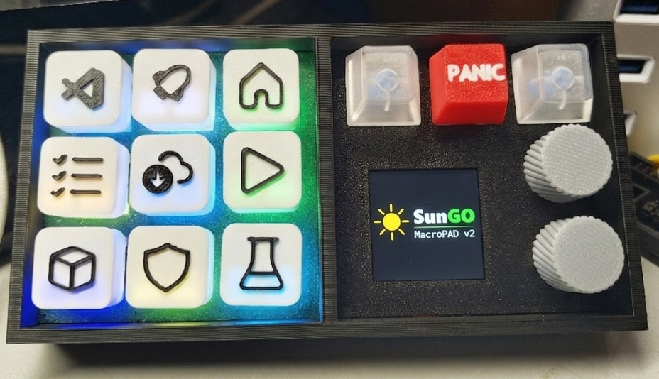

# [BUILD] SunGo MacroPAD v2 — 



How to build your own 3x3 + 3 pad with RGB, dual encoders, and a 240x240 LCD. This is an evolution of the previous v1 version.

Below is a complete description for anyone wishing to build their own unit. The firmware is already in a stable version and fully integrates with the dedicated **VSCode** extension, so you can confidently start your project.

---

## 🛒 Shopping List

* **Switches:** 12x mechanical switches (e.g., Cherry MX Blue or any popular clone).
* **Backlighting:** 12x **WS2812B** addressable LEDs (individual LEDs from a strip can be used).
* **Encoders:** 2x standard rotary encoders (panel-mounted).
* **Display:** 1.54" TFT 240x240 SPI with ST7789 controller.
* **Microcontroller:** **RP2040** board (recommended: Pimoroni PGA2040, Waveshare RP2040 Zero, or compatible).
* **Wiring:** Thin wires; optionally, a piece of Ethernet cable (works great as stiff wire for matrix connections).
* **Case:** 3D Printed. Project uses this model: [SunGo MacroPAD on MakerWorld](https://makerworld.com/pl/models/109775#profileId-1092486).

---

## Pimoroni PGA2040


### Pinout:


---

## USB-C Socket


*Useful for Pimoroni PGA boards.*

## 🔧 Switch Connection

Switches operate in a **3x3 matrix** (plus expansion) in **Direct** mode with a common ground (GND).

### Layout Schema:

| | | | | | |
| :---: | :---: | :---: |:---: |:---: |:---: |
| SW1 | SW2 | SW3 | SW10 | SW11 | SW12 |
| SW4 | SW5 | SW6 |      |      | ENC0 |
| SW7 | SW8 | SW9 |      |      | ENC1 |

### GPIO Pin Mapping:

| Switch | GPIO Pin | Switch | GPIO Pin | Switch | GPIO Pin |
| :--- | :--- | :--- | :--- | :--- | :--- |
| **SW1** | GPIO2 | **SW2** | GPIO3 | **SW3** | GPIO4 |
| **SW4** | GPIO7 | **SW5** | GPIO6 | **SW6** | GPIO5 |
| **SW7** | GPIO8 | **SW8** | GPIO9 | **SW9** | GPIO10|
| **SW10**| GPIO11| **SW11**| GPIO12| **SW12**| GPIO13|

### Encoder Buttons:

| Switch | GPIO Pin |
| :--- | :--- |
| **ENC0** | GPIO14 |
| **ENC1** | GPIO15 |

### Encoders:

| Encoder | Pin | GPIO Pin |
| :--- | :--- | :--- |
| **ENC0** | A | GPIO22 |
|          | B | GPIO24 |
| **ENC1** | A | GPIO23 |
|          | B | GPIO25 |

---

## 🌈 Connecting WS2812B LEDs (RGB)

LEDs are connected in series using a **"snake"** pattern. The signal zig-zags under the switches, simplifying wire routing and optimizing the signal path.

### LED Connection Diagram:

```text
LED0 (SW1) ──► LED1 (SW2) ──► LED2 (SW3)    | ──►LED9 (SW10) ──► LED10 (SW11) ──► LED11 (SW12)
                                  │          |
LED5 (SW4) ◄── LED4 (SW5) ◄── LED3 (SW6)    |
  │                                          |
LED6 (SW7) ──► LED7 (SW8) ──► LED8 (SW9) ──►|
```

- Data Pin (DIN): Connected to GPIO16.
- Power: LEDs can be powered with 3.3V.

Power Management: Firmware limits brightness to 40%. This ensures great visibility while keeping current draw safe for USB 2.0 standards and newer.

NOTE: During assembly, pay close attention to LED orientation. The arrows on WS2812B housings indicate the direction of data flow (Data Out).

### 📺 Connecting LCD SPI:

We use SPI0 on the RP2040:
```
GPIO18 -- CLK
GPIO19 -- TX (MOSI)
GPIO17 -- CS
GPIO20 -- DC
GPIO21 -- RST
```
## ⚠️ ATTENTION: Compatibility
SunGo MacroPAD II requires the latest version of the SunGO Project Manager extension.

Starting from version v2.3.7 - Hardware recognition introduced.

Firmware 5.0 for SunGo MacroPAD II is not compatible with earlier extension versions.

Hardware recognition in the extension is linked to the expansion of the MacroPAD configuration panel and new features. The new Configuration panel will be available in the extension shortly. Currently, in the test firmware, the MacroPAD retains v1 functionality with added LCD visualization.

## 🐧 Linux Setup
Linux requires adding udev rules for the new device. Update your rules file if you had PAD v1 or create a new one at /etc/udev/rules.d/99-sungo.rules, adding the following:

```
# Rule for SunGo MacroPAD I
SUBSYSTEM=="hidraw", ATTRS{idVendor}=="cafe", ATTRS{idProduct}=="4050", MODE="0666"

# Rule for SunGo MacroPAD II
SUBSYSTEM=="hidraw", ATTRS{idVendor}=="cafe", ATTRS{idProduct}=="5050", MODE="0666"
```

After saving the file, reload the rules with:

```
sudo udevadm control --reload-rules && sudo udevadm trigger
```
## 💾 Software and Configuration

Firmware for Macropad V2 will be available soon...

### Firmware Installation
Prepare the firmware file in .uf2 format.

Connect the RP2040 board to your computer while holding the BOOTSEL button.

The device will be detected as a removable drive.

Drag and drop the .uf2 file onto this drive. Once successfully flashed, the MacroPAD will restart and be ready for use.

Keycaps
If you are using a Bambu Lab printer with an AMS system (e.g., A1 model), you will find dedicated multi-color keycap projects in the attachments for a professional finish.

### SunGo MacroPAD v2 Project — 2026
